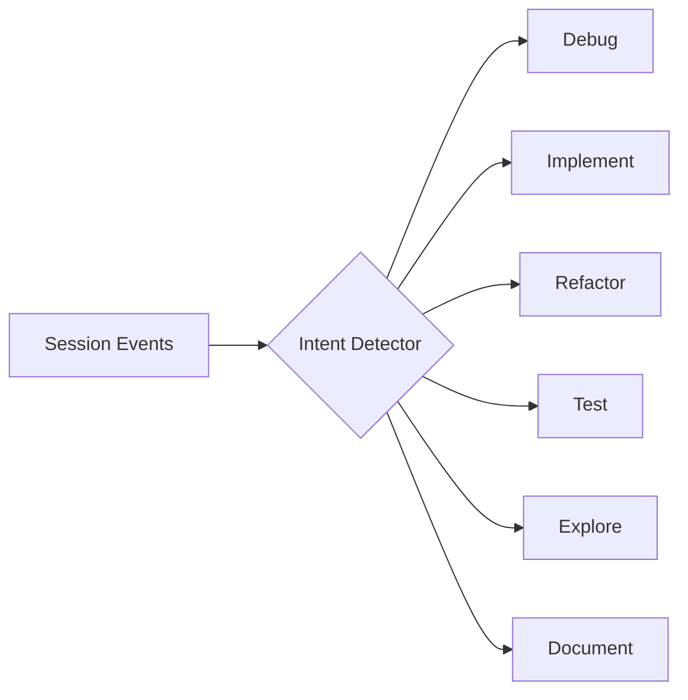
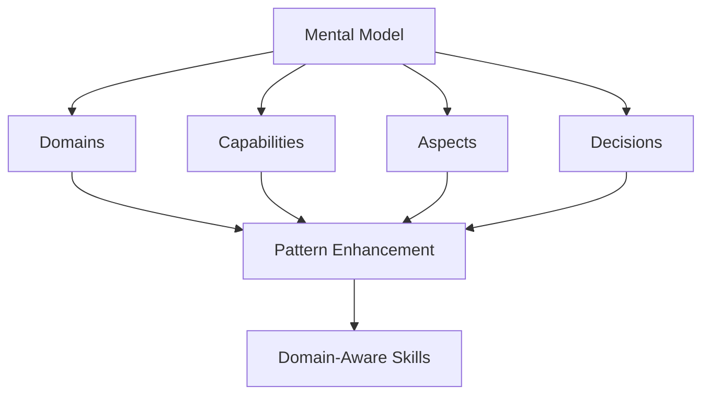
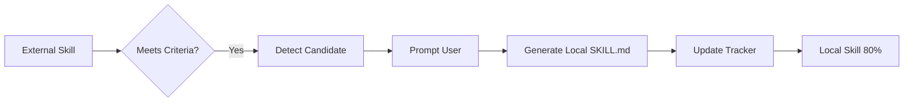
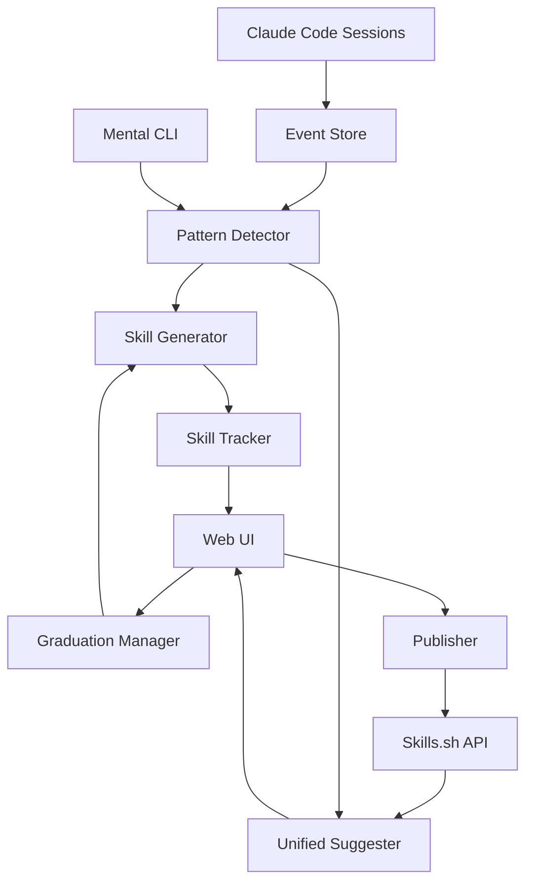

# Features Overview

Claude Auto-Skill is the most comprehensive skill management system for AI assistants. This page provides a high-level overview of all features.

## 🎯 Core Philosophy

**Learn from YOUR work, not generic templates.**

Unlike skill marketplaces that offer one-size-fits-all solutions, Auto-Skill watches how YOU work and generates personalized skills that match YOUR patterns.

---

## 🧠 V2 Core Features

### Session Analysis

Understands the **intent** behind your work:



**6 Intent Types**:

- **Debug**: Error fixing, troubleshooting
- **Implement**: New features, functionality
- **Refactor**: Code improvement, restructuring
- **Test**: Writing/running tests
- **Explore**: Investigation, learning
- **Document**: Adding docs, comments

[Learn more →](session-analysis.md)

### LSP Integration

Deep code structure understanding via Language Server Protocol:

- **Python AST**: Classes, functions, methods, decorators
- **Dependencies**: Import graphs, module relationships
- **Framework Support**: Extensible (JS/TS coming)

```python
# Detected structure
{
  "classes": ["PaymentProcessor", "Order"],
  "functions": ["calculate_total", "apply_discount"],
  "imports": ["stripe", "decimal"],
  "framework": "FastAPI"
}
```

### Design Pattern Detection

**18 Patterns** across three categories:

=== "Architectural (8)"

    - MVC (Model-View-Controller)
    - Repository Pattern
    - Factory Pattern
    - Singleton Pattern
    - Strategy Pattern
    - Observer Pattern
    - Adapter Pattern
    - Dependency Injection

=== "Coding (6)"

    - Error Handling
    - REST API Design
    - Async Patterns
    - Decorators
    - Context Managers
    - Builder Pattern

=== "Workflow (4)"

    - TDD (Test-Driven Development)
    - Refactor-Safe
    - Debug-Systematic
    - Explore-Then-Implement

[Learn more →](pattern-detection.md)

---

## 🔄 Hybrid Integration

### Mental Model Integration

**First-of-its-kind** integration with Mental CLI:



**Benefits**:

- **Semantic Context**: Skills understand WHAT they operate on
- **Smart Suggestions**: Only relevant skills shown
- **Documentation**: Auto-generated docs reference decisions
- **Team Alignment**: Shared understanding via Mental model

[Learn more →](mental-model.md)

### External Discovery (Skills.sh)

Access **27,471+ community skills** from skills.sh:

```bash
# Search external skills
python -m commands.discover --search "payment processing"

# Results
1. stripe-integration (4.5★, 342 installs)
2. payment-retry-logic (4.2★, 128 installs)
3. fraud-detection (4.7★, 89 installs)
```

**Integration Features**:

- Tag-based search
- Install count tracking
- Community ratings
- Automatic metadata import

[Learn more →](external-discovery.md)

### Confidence Evolution

Skills evolve from untested to trusted:

```
External (50%) 
    ↓ 3 uses, 70% success
Proven (75%)
    ↓ 5 uses, 80% success
Local (85%)
    ↓ continued success
Expert (100%)
```

**Factors**:

- **Usage count**: More uses = higher confidence
- **Success rate**: Successful completions boost confidence
- **Recency**: Recent successes weighted higher
- **Source**: Local skills start at 80%, external at 50%

---

## 🎓 Advanced Features

### Automatic Graduation

**Promote proven external skills to trusted local skills.**

#### Graduation Criteria

```yaml
confidence: ≥ 85%
usage_count: ≥ 5
success_rate: ≥ 80%
```

#### Graduation Process



#### CLI Usage

```bash
# Interactive graduation
python -m core.graduation_manager

# Auto-graduate top 5
python -m core.graduation_manager auto 5

# Show statistics
python -m core.graduation_manager stats
```

[Learn more →](graduation.md)

### Skills.sh Publishing

**Share your skills with the community.**

#### Publishable Criteria

- Has YAML frontmatter
- Has description section
- Has usage section
- Minimum 500 characters

#### Publishing Workflow

```bash
# Detect publishable skills
python -m core.skillssh_publisher detect

# Publish a skill
python -m core.skillssh_publisher publish my-skill

# Sync community stats
python -m core.skillssh_publisher sync
```

**Community Stats**:

- Install count
- Community rating (1-5 stars)
- Views
- Last updated

[Learn more →](publishing.md)

### Web UI

**Visual interface for everything.**

#### Features

**Dashboard** 📊:

- Total skills (local + external)
- Usage statistics
- Success rate trends
- Top skills

**Skill Browser** 🔍:

- Grid view with search
- Confidence bars
- Source badges
- Click for details

**Graduation Tab** 🎓:

- Visual candidate cards
- One-click graduation
- Real-time updates

**Publishing Tab** 📤:

- Publishable skills list
- One-click publishing
- Community stats

```bash
# Start web UI
cd web
python app.py
# Open http://localhost:5000
```

[Learn more →](web-ui.md)

---

## 🎯 Use Cases

### Solo Developer

**Scenario**: Building a SaaS product

**Benefits**:

- Automatically learn your coding patterns
- Build a personalized skill library
- Save time on repetitive tasks
- Improve code consistency

### Team Lead

**Scenario**: Standardizing team workflows

**Benefits**:

- Share team-approved skills
- Track skill adoption across team
- Publish internal skills to skills.sh (private)
- Mental Model alignment

### Open Source Maintainer

**Scenario**: Managing multiple projects

**Benefits**:

- Cross-project pattern reuse
- Community skill contribution
- External skill discovery
- Automated skill publishing

### Enterprise

**Scenario**: Large-scale development

**Benefits**:

- Organization-wide skill library
- Compliance and security patterns
- Audit trail (adoption tracking)
- Integration with existing tools

---

## 📊 Architecture Overview



### Components

| Component | Purpose |
|-----------|---------|
| **Event Store** | SQLite database of tool calls |
| **Pattern Detector** | Finds repeated sequences |
| **Skill Generator** | Creates SKILL.md files |
| **Skill Tracker** | Tracks adoption & confidence |
| **Unified Suggester** | Multi-source discovery |
| **Graduation Manager** | External → Local promotion |
| **Publisher** | Skills.sh integration |
| **Web UI** | Visual interface |

[Architecture details →](../reference/architecture.md)

---

## 🚀 Performance

### Benchmarks

| Operation | Events | Time |
|-----------|--------|------|
| **Event Insert** | 1,000 | < 5s |
| **Pattern Detection** | 100 sessions | < 3s |
| **Skill Generation** | 1 skill | < 0.1s |
| **Database Query** | 10,000 events | < 2s |

### Scaling

- **Events**: Tested with 100,000+ events
- **Skills**: Tested with 1,000+ skills
- **Database**: 100 MB+ works smoothly
- **Memory**: 512 MB sufficient for most use cases

### Optimization

- **Indices**: On frequently queried columns
- **Batch Operations**: Bulk inserts for imports
- **Lazy Loading**: Skills loaded on-demand
- **Caching**: Compiled patterns cached

---

## 🔒 Security

### Data Privacy

- **Local-first**: All data stored locally
- **No telemetry**: Zero phone-home
- **No tracking**: Your patterns stay yours

### API Keys

- **Skills.sh**: Optional (only for publishing)
- **Mental**: No API key needed
- **Storage**: Plain text config (use env vars for secrets)

### Permissions

- **File Access**: Read-only for pattern detection
- **Network**: Only for skills.sh (optional)
- **Database**: SQLite (no external DB required)

---

## 🎨 Customization

### Configuration

Customize via `~/.claude/auto-skill.local.md`:

```yaml
---
detection:
  min_occurrences: 3       # Pattern threshold
  min_confidence: 0.7      # Confidence threshold
  lookback_days: 7         # History window

hybrid:
  enable_mental: true      # Mental Model
  enable_external: true    # Skills.sh
  auto_graduate: true      # Auto-graduation

v2:
  enable_session_analysis: true
  enable_lsp_analysis: true
  enable_pattern_detection: true
---
```

### Skill Templates

Customize generated skill format:

```python
# Override in core/skill_generator.py
def _generate_skill_content(self, pattern):
    return f"""---
name: {pattern.name}
custom_field: my_value
---

# {pattern.name}

My custom template...
"""
```

### Web UI Themes

Edit `web/templates/index.html`:

```css
/* Change color scheme */
:root {
  --primary: #667eea;    /* Purple */
  --secondary: #764ba2;  /* Deep purple */
  --success: #4caf50;    /* Green */
  --danger: #f44336;     /* Red */
}
```

---

## 📚 Next Steps

<div class="grid cards" markdown>

-   :material-download: **[Installation](../getting-started/installation.md)**

    Get started with installation and setup

-   :material-rocket: **[Quick Start](../getting-started/quick-start.md)**

    Generate your first skill in 5 minutes

-   :material-book: **[User Guide](../guide/cli-commands.md)**

    Complete CLI command reference

-   :material-help-circle: **[FAQ](../faq.md)**

    Common questions answered

</div>
